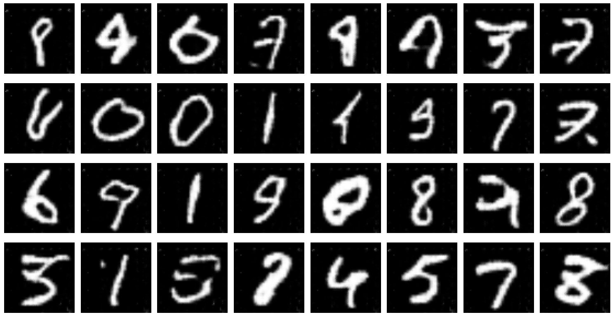
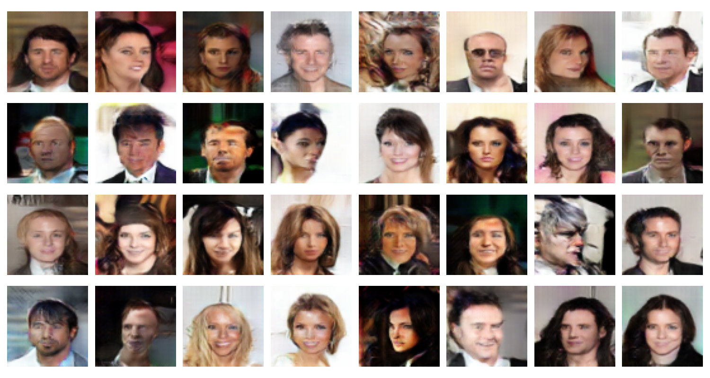

# Deep Convolutional Generative Adversarial Network (DCGAN) - MNIST and CELEBA

This repository contains a Deep Convolutional Generative Adversarial Network (DCGAN) implementation trained on two datasets:
- **MNIST**: Trained for 4 epochs to generate handwritten digit images.
- **CELEBA**: Trained for 10 epochs to generate celebrity face images.

## Datasets Used
- **MNIST**: A dataset of 60,000 handwritten digits.
- **CELEBA**: A large-scale face dataset containing more than 200,000 celebrity images.

## Model Description

The DCGAN architecture consists of two main components:

1. **Generator**: The generator network takes random noise as input and transforms it into synthetic images that resemble real images from the dataset. It utilizes transposed convolutional layers to upsample the input noise to the desired image size.

2. **Discriminator**: The discriminator network evaluates whether a given image is real (from the dataset) or fake (produced by the generator). It uses convolutional layers to extract features and provide a probability that the image is real.

### Architecture Details
- **Generator**:
  - **Input**: Random noise vector.
  - **Layers**: Transposed convolutional layers with batch normalization and ReLU activation.
  - **Output**: Image with desired dimensions.

- **Discriminator**:
  - **Input**: Image from dataset or generated by the generator.
  - **Layers**: Convolutional layers with batch normalization and LeakyReLU activation.
  - **Output**: Probability indicating whether the image is real or fake.

## Sample Results
Some generated samples from both datasets are displayed below:

- **MNIST** (Trained for 4 epochs):  
  

- **CELEBA** (Trained for 10 epochs):  
  

## How to Run

1. **Clone the Repository:**
   ```bash
   git clone https://github.com/Ganesh2609/DCGAN.git
   cd DCGAN
   
2. **Run the `test_gan.ipynb`**: Execute the notebook to generate synthetic images. Each time the code runs, it generates different images based on the current state of the trained model.
