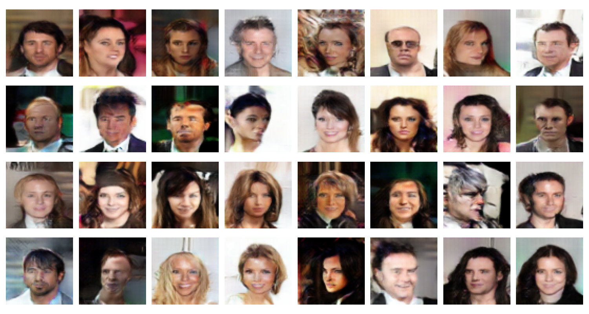

# Deep Convolutional Generative Adversarial Network (DCGAN) - MNIST and CELEBA

This repository contains a Deep Convolutional Generative Adversarial Network (DCGAN) implementation trained on two datasets:
- **MNIST**: Trained for 4 epochs to generate handwritten digit images.
- **CELEBA**: Trained for 10 epochs to generate celebrity face images.

## Datasets Used
- **MNIST**: A dataset of 60,000 handwritten digits.
- **CELEBA**: A large-scale face dataset containing more than 200,000 celebrity images.

## Sample Results
Some generated samples from both datasets are displayed below:

- **MNIST** (Trained for 4 epochs):  
  

- **CELEBA** (Trained for 10 epochs):  
  


## How to Run

1. **Clone the Repository:**
   ```bash
   git clone https://github.com/Ganesh2609/DCGAN.git
   cd DCGAN
2. **Run the test_gan.ipynb** : Run the above file to generate the fake images, each time the code runs, it generates different images.


